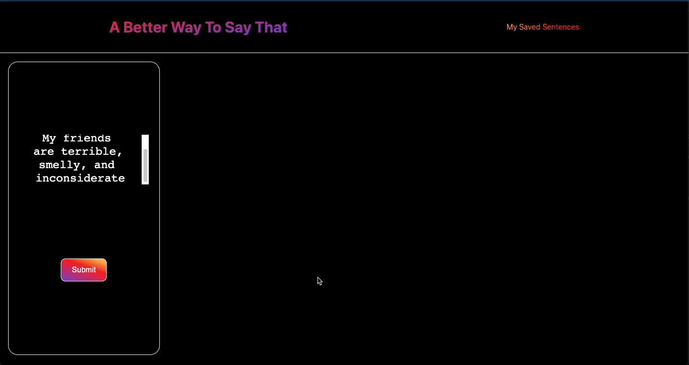
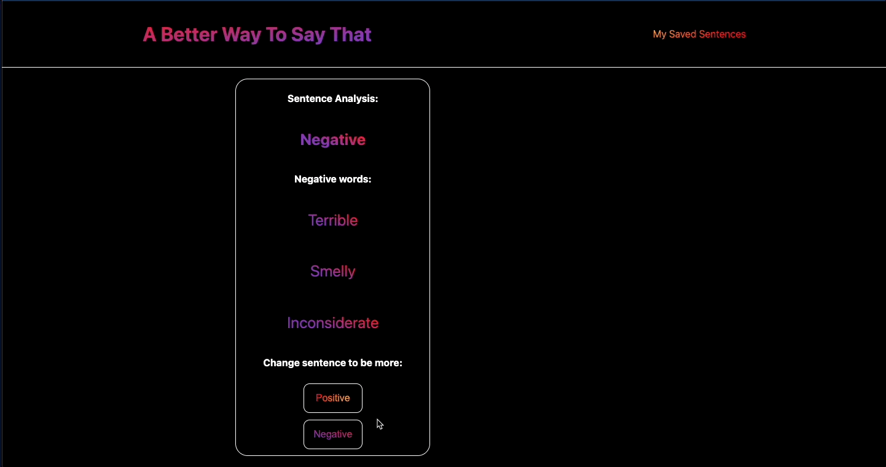

# *A Better Way To Say That*

## Deployed Here: [https://a-better-way-to-say-that.herokuapp.com/](https://a-better-way-to-say-that.herokuapp.com/)

### Table of Contents
- [Overview](#overview)
- [Installation & Viewing](#installation-and-viewing)
- [Technologies Used](#technologies-used)
- [Sample Sentences](#sample-sentences)
- [Functionality](#functionality)
- [Future Additions](#future-additions)
- [Author](#author)

## Overview 

A Better Way To Say That uses a Sentiment Analysis API from [Meaning Cloud](https://www.meaningcloud.com/developer/sentiment-analysis) and the Collegiate Thesaurus API from [Merriam Webster](https://dictionaryapi.com/products/api-collegiate-thesaurus) to help users think of more positive or negative ways to say what they want to say. The sentiment analysis API identifies a sentence's overall tone and sorts out positive and negative words from that sentence. The Thesaurus API helps to replace positive or negative words in the sentence with randomly chosen synonyms or antonyms depending on how the user wants to change their sentence.

View original project spec here: [project](https://frontend.turing.edu/projects/module-3/niche-audience.html)

Learning Goals:

-  Apply everything learned so far about React, Cypress, and fetching from APis by building a React app in one week 
-  Go beyond a simple Ideabox React App by posting data to two APIs and combining / manipulating returned API data
-  Use conditional styling and gradients to enhance the UI of the app

## Installation and Viewing 

My application is deployed to Heroku. You may view the live application [here](https://a-better-way-to-say-that.herokuapp.com/)

To view this application on your local device:

- Clone down this repository
- Run `npm i` in your terminal
- Run `npm start` in your terminal
- To view Cypress tests open a separate tab in your terminal and run `npm run cypress`

### Technologies Used

 
    
    
    
    
    

## Sample Sentences

Here are some sample sentence transformations:

Original: 

### "I think you are funny, admirable, and nice" 

New: 

### "I think you are ordinary, pathetic, and ill-natured"

---

Original:

### "Taylor is an inept and weak programmer"

New:

### "Taylor is a prudent and rational programmer" 

---

Original:

### "Bananas are healthy and good for you"

New:

### "Bananas are unprosperous and uncertain for you"

---

## Functionality 

#### See sentence analyzed
- A user may submit a sentence, see their sentence analyzed for overall tone, and see which words in their sentence were positive or negative  

#### Make sentence negative
- A user can choose to make their submitted sentence more negative 

#### Make sentence positive
- A user can choose to make their submitted sentence more positive 

#### Save a sentence
- A user can choose to save their new sentence 

#### View saved sentences
- A user can view their saved sentences 

## Future Additions

- Add the ability to adjust which words get changed and which stay the same when converting sentences
- Allow user to convert multiple sentences at once
- Allow user to swap out any word in their sentence for random synonyms or antonmys
- Allow user to choose from a list of synonyms or antonyms to replace words in their sentence with 

### Author
- [Taylor Galloway](https://github.com/tylrs)

**************************************************************************

**[Back to top](#table-of-contents)**
